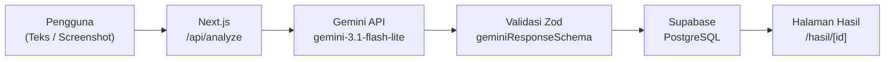

# CekDulu — Sebelum percaya dan transfer, CekDulu.

> Alat edukasi pemeriksaan pesan digital berbasis AI untuk membantu masyarakat mengenali indikasi penipuan sebelum mengambil keputusan.

---

## Ringkasan

**CekDulu** adalah aplikasi web yang membantu pengguna melakukan pemeriksaan awal terhadap pesan digital yang mencurigakan. Pengguna dapat menempel teks pesan atau mengunggah screenshot dari WhatsApp, SMS, email, maupun media sosial. Sistem kemudian menganalisis konten menggunakan AI dan menampilkan skor risiko, tingkat risiko, indikator penipuan, penjelasan, serta rekomendasi tindakan aman.

---

## Latar Belakang

Penipuan digital terus berkembang melalui berbagai modus seperti hadiah palsu, investasi ilegal, lowongan kerja palsu, penyamaran sebagai lembaga resmi, dan permintaan transfer dengan tekanan waktu. Berdasarkan data Indonesia Anti-Scam Centre (IASC), terdapat lebih dari 411.000 laporan penipuan sejak akhir 2024. Banyak pengguna belum mampu mengenali tanda-tanda penipuan dan sering mengambil keputusan tanpa verifikasi terlebih dahulu.

---

## Target Pengguna

- Pengguna aktif WhatsApp, SMS, email, dan media sosial
- Pelajar, mahasiswa, dan masyarakat umum
- Orang tua dan pengguna yang belum memahami modus penipuan digital
- Siapapun yang menerima pesan atau penawaran mencurigakan

---

## Value Proposition

CekDulu tidak hanya memberi peringatan, tetapi juga **menjelaskan alasan** di balik penilaian dan memberikan **rekomendasi tindakan konkret** agar pengguna dapat membuat keputusan yang lebih aman dan terinformasi.

---

## Fitur Utama

| Fitur | Keterangan |
|-------|-----------|
| 🔐 Autentikasi | Registrasi & login email/password via Supabase Auth |
| 📝 Analisis Teks | Tempel teks pesan dan analisis dengan AI |
| 🖼️ Analisis Screenshot | Unggah screenshot (JPEG/PNG/WebP, maks. 5 MB) untuk ekstraksi teks + analisis |
| 📊 Skor & Tingkat Risiko | Skor 0–100 dan tiga level: Rendah / Sedang / Tinggi |
| 🚩 Indikator Penipuan | Daftar tanda-tanda mencurigakan yang ditemukan dalam pesan |
| 📖 Penjelasan AI | Narasi analisis dalam Bahasa Indonesia yang mudah dipahami |
| ✅ Rekomendasi Tindakan | Saran langkah konkret yang harus diambil pengguna |
| 🏠 Dashboard | Statistik pemeriksaan (total, tinggi, sedang, rendah) + 5 terbaru |
| 📋 Riwayat Analisis | Seluruh riwayat pemeriksaan milik pengguna |

---

## Alur Kerja Aplikasi

```
Pengguna membuka /periksa
    │
    ├─ Mode Teks: paste pesan → kirim JSON
    └─ Mode Gambar: upload screenshot → kirim multipart/form-data
            │
            ▼
    Next.js /api/analyze (Server-only)
            │
            ├─ Validasi autentikasi (Supabase Auth)
            ├─ Validasi input (Zod)
            │
            ▼
    Gemini API (gemini-3.1-flash-lite)
            │
            ├─ Mode teks: analisis indikasi penipuan
            └─ Mode gambar: OCR + analisis indikasi penipuan
            │
            ▼
    Validasi Respons (Zod)
            │
            ▼
    Supabase PostgreSQL (simpan hasil)
            │
            ▼
    Redirect → /hasil/[id]
```

### Diagram Mermaid



---

## Teknologi

| Teknologi | Peran |
|-----------|-------|
| **Next.js 16** (App Router) | Framework utama, Server Components, Route Handlers |
| **TypeScript** | Type-safe development |
| **Tailwind CSS v4** | Styling responsif |
| **Supabase Auth** | Manajemen autentikasi pengguna |
| **Supabase PostgreSQL** | Penyimpanan hasil analisis |
| **Google Gemini API** | Model AI untuk analisis teks & gambar |
| **Zod** | Validasi input dan respons AI |
| **Vercel** | Deployment dan hosting |

---

## Arsitektur

```
Browser (Client)
    │  JSON (mode teks) / multipart (mode gambar)
    ▼
Next.js Route Handler: /api/analyze  ← GEMINI_API_KEY hanya di sini
    │  Supabase Server Client (cookie-based session)
    ▼
Supabase PostgreSQL (tabel analyses, RLS aktif)
```

- **Server Components** digunakan untuk dashboard, riwayat, dan hasil (data-fetching di server)
- **Client Component** hanya pada `PeriksaForm.tsx` (interaksi state, file upload)
- **GEMINI_API_KEY** tidak pernah dikirim ke browser

---

## Struktur Folder

```
src/
├── app/
│   ├── actions/auth.ts        # Server Actions: login, register, logout
│   ├── api/analyze/route.ts   # POST handler: Gemini + Supabase
│   ├── dashboard/page.tsx     # Halaman dashboard (Server Component)
│   ├── hasil/[id]/page.tsx    # Halaman hasil analisis (Server Component)
│   ├── login/page.tsx         # Halaman login
│   ├── periksa/
│   │   ├── page.tsx           # Halaman /periksa (Server Component)
│   │   └── PeriksaForm.tsx    # Form input (Client Component)
│   ├── proxy/route.ts         # Session refresh handler
│   ├── register/page.tsx      # Halaman registrasi
│   ├── riwayat/page.tsx       # Halaman riwayat (Server Component)
│   ├── globals.css            # Design system & custom utilities
│   ├── icon.png               # Favicon
│   └── layout.tsx             # Root layout
├── components/
│   ├── AnalysisCard.tsx       # Kartu ringkasan analisis
│   ├── Navbar.tsx             # Navbar bersama (Server Component)
│   └── RiskBadge.tsx          # Badge tingkat risiko
└── lib/
    ├── schemas.ts             # Zod schemas (request & Gemini response)
    └── supabase/
        ├── client.ts          # Supabase browser client
        └── server.ts          # Supabase server client (SSR)
```

---

## Struktur Tabel `analyses`

```sql
CREATE TABLE public.analyses (
  id              UUID PRIMARY KEY DEFAULT gen_random_uuid(),
  user_id         UUID NOT NULL REFERENCES auth.users(id),
  input_text      TEXT NOT NULL,
  risk_score      INTEGER NOT NULL,
  risk_level      TEXT NOT NULL,
  scam_type       TEXT NOT NULL,
  indicators      JSONB NOT NULL,
  explanation     TEXT NOT NULL,
  recommendations JSONB NOT NULL,
  created_at      TIMESTAMPTZ DEFAULT now()
);

-- Row Level Security
ALTER TABLE public.analyses ENABLE ROW LEVEL SECURITY;

CREATE POLICY "User can read own analyses"
  ON public.analyses FOR SELECT
  USING (auth.uid() = user_id);

CREATE POLICY "User can insert own analyses"
  ON public.analyses FOR INSERT
  WITH CHECK (auth.uid() = user_id);
```

> **Catatan:** Untuk mode screenshot, `input_text` berisi teks yang diekstrak oleh AI dari gambar. Gambar itu sendiri **tidak disimpan** ke database maupun filesystem.

---

## Instalasi Lokal

### Prasyarat

- Node.js 18+
- npm atau yarn
- Akun Supabase
- Akun Google AI Studio (Gemini API Key)

### Langkah Instalasi

```bash
# 1. Clone repository
git clone https://github.com/username/cekdulu.git
cd cekdulu

# 2. Install dependencies
npm install

# 3. Salin dan isi environment variables
cp .env.example .env.local
```

### Environment Variables

Buat file `.env.local` di root project dengan isi berikut:

```env
NEXT_PUBLIC_SUPABASE_URL=
NEXT_PUBLIC_SUPABASE_PUBLISHABLE_KEY=
GEMINI_API_KEY=
```

| Variable | Keterangan |
|----------|-----------|
| `NEXT_PUBLIC_SUPABASE_URL` | URL project Supabase Anda |
| `NEXT_PUBLIC_SUPABASE_PUBLISHABLE_KEY` | Publishable/anon key Supabase |
| `GEMINI_API_KEY` | API Key dari Google AI Studio (hanya digunakan server-side) |

> ⚠️ **Jangan pernah** meng-commit `.env.local` ke repository atau membagikan `GEMINI_API_KEY` ke publik.

---

## Menjalankan Lokal

```bash
# Development server
npm run dev
```

Buka [http://localhost:3000](http://localhost:3000) di browser.

---

## Build Production

```bash
npm run build
```

Build berhasil apabila output menampilkan `Exit code: 0` dan tidak ada TypeScript error.

---

## Deploy ke Vercel

```bash
# Menggunakan Vercel CLI
npm i -g vercel
vercel --prod
```

Atau hubungkan repository ke [vercel.com](https://vercel.com) dan isi environment variables di dashboard Vercel:

- `NEXT_PUBLIC_SUPABASE_URL`
- `NEXT_PUBLIC_SUPABASE_PUBLISHABLE_KEY`
- `GEMINI_API_KEY`

---

## Keamanan

| Aspek | Implementasi |
|-------|-------------|
| **Row Level Security** | Setiap pengguna hanya dapat membaca/menulis data miliknya sendiri |
| **API Key Server-Only** | `GEMINI_API_KEY` hanya diakses di Route Handler, tidak pernah dikirim ke browser |
| **Gambar Tidak Disimpan** | Screenshot dikonversi ke base64 di server untuk analisis AI, kemudian dibuang. Hanya teks hasil ekstraksi yang disimpan ke database |
| **Validasi File** | MIME type (JPEG/PNG/WebP) dan ukuran (≤ 5 MB) divalidasi di client dan server |
| **Validasi Zod** | Seluruh input pengguna dan respons AI divalidasi dengan Zod schema |
| **Jailbreak Mitigation** | System prompt memerintahkan AI untuk memperlakukan input sebagai data, bukan instruksi |

---

## Batasan dan Disclaimer

CekDulu adalah alat **edukasi dan pemeriksaan awal** berbasis AI. Hasil analisis:

- **Bukan** merupakan kepastian hukum
- **Bukan** jaminan bahwa suatu pesan pasti aman atau pasti penipuan
- Dapat memiliki keterbatasan akurasi, terutama untuk modus penipuan baru

Pengguna tetap perlu melakukan verifikasi melalui saluran resmi sebelum mengambil keputusan. **Jangan memasukkan** password, PIN, OTP, nomor kartu, CVV, atau data pribadi sensitif lainnya ke dalam sistem.

---

## Rencana Pengembangan

- [ ] Deteksi tautan/domain mencurigakan
- [ ] Pemeriksaan reputasi nomor telepon
- [ ] Basis data modus penipuan komunitas
- [ ] Pelaporan anonim dari masyarakat
- [ ] Peta tren penipuan berdasarkan kategori
- [ ] Integrasi kanal pelaporan resmi (IASC)
- [ ] Ekstensi browser
- [ ] Aplikasi Android dan iOS
- [ ] Integrasi langsung dengan WhatsApp

---

## Pembuat

| | |
|-|-|
| **Nama** | [Nama Anda] |
| **Institusi** | [Universitas / Organisasi Anda] |
| **Email** | [email@example.com] |
| **GitHub** | [@username](https://github.com/username) |
| **Hackathon** | [Nama Hackathon & Tahun] |

---

## Lisensi

[MIT License](LICENSE)

---

> _CekDulu — Sebelum percaya dan transfer, CekDulu._
